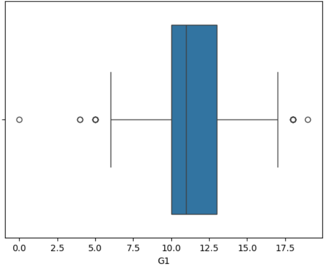
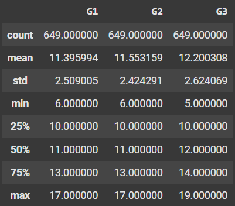
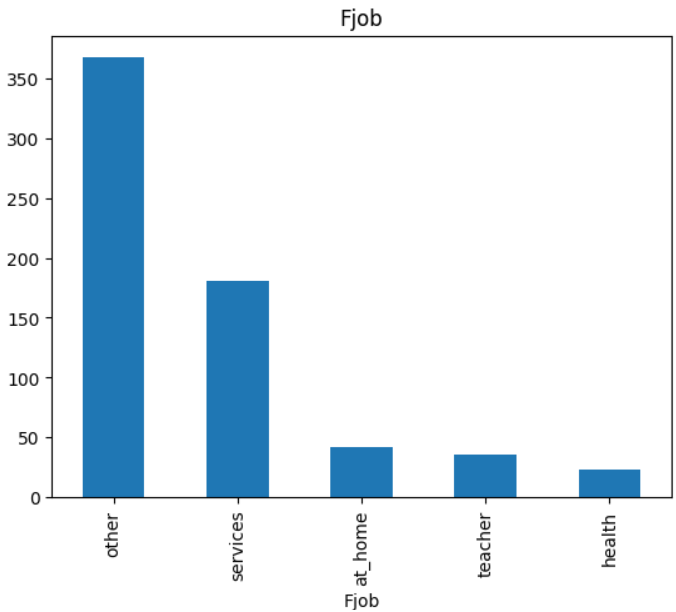
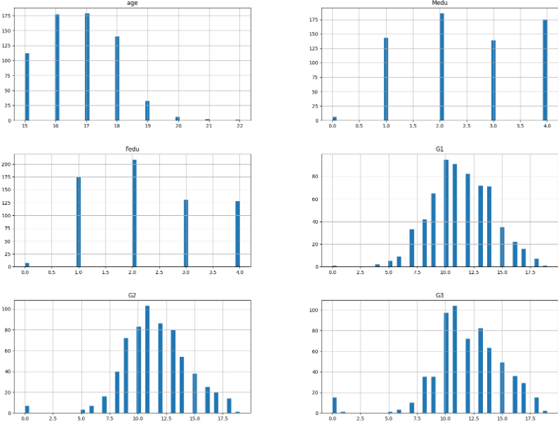
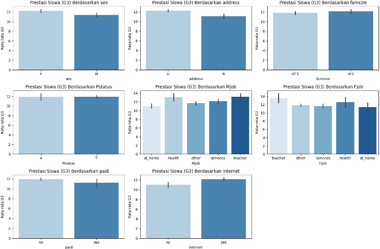
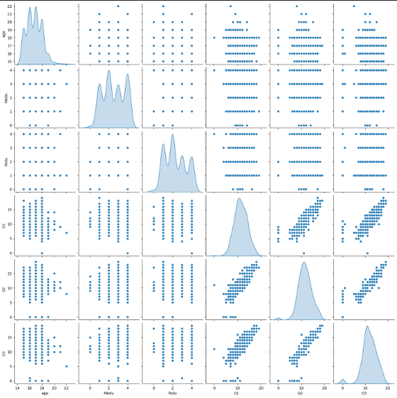
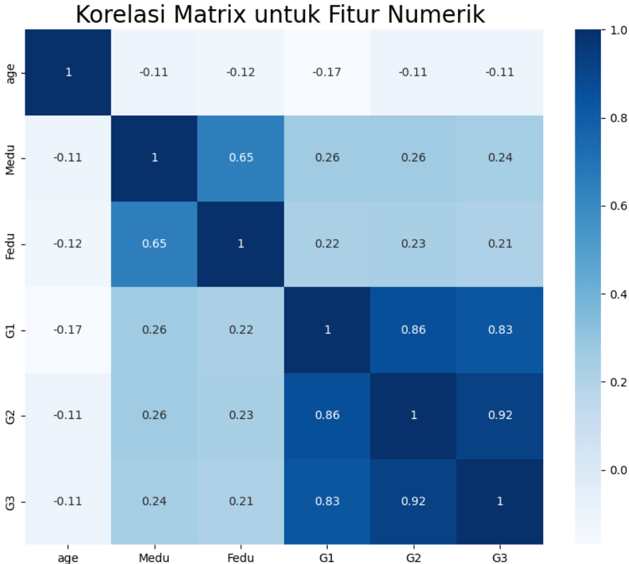
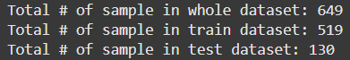
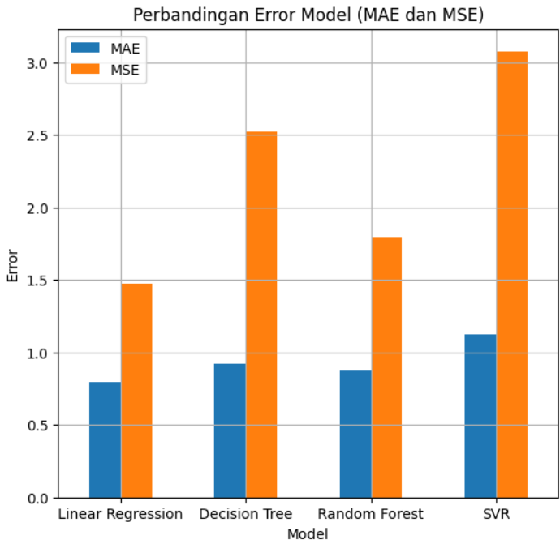
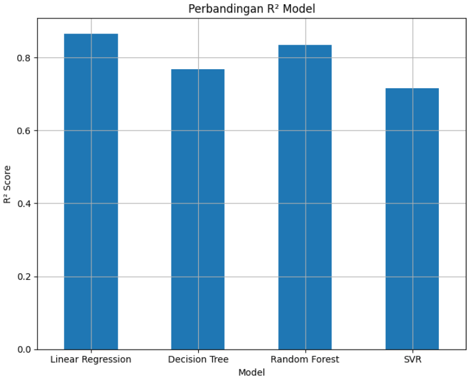

# Predictive Analysis | Socioeconomic Status and Academic Performance

###

## 📌 Domain Project

* Bidang: Pendidikan
* Tujuan: Untuk menganalisis hubungan antar latar belakang sosial ekonomi dan prestasi akademik siswa.
* Jenis Analisis : Analisis Regresi

###

## 📌Latar Belakang
Kesenjangan prestasi akademik antara siswa dari latar belakang sosial ekonomi yang berbeda merupakan masalah global. Faktor-faktor seperti status sosial ekonomi keluarga, akses terhadap sumber daya pendidikan, dan lingkungan belajar yang berbeda dapat mempengaruhi kinerja siswa. 

Analisis data ini bertujuan untuk mengidentifikasi faktor-faktor sosial ekonomi yang paling signifikan berkontribusi pada kesenjangan ini dan memberikan rekomendasi untuk merancang program yang efektif.

### Mengapa masalah ini penting untuk diselesaikan?

* Keadilan Sosial: Setiap siswa berhak mendapatkan kesempatan yang sama untuk meraih potensi terbaiknya. Kesenjangan prestasi menghambat terwujudnya keadilan sosial.
* Pertumbuhan Ekonomi: Tenaga kerja yang berkualitas adalah kunci pertumbuhan ekonomi. Kesenjangan prestasi dapat menghambat produktivitas nasional.
* Kohesi Sosial: Kesenjangan prestasi dapat memicu ketimpangan sosial dan memicu konflik.

### Referensi Penelitian Terdahulu:
> Juhaidi, A. (2023). Gender, Latar Belakang Sosio-ekonomi Keluarga, dan Prestasi Akademik Mahasiswa (Kasus pada Universitas Islam Negeri Terbesar di Kalimantan). Metta: Jurnal Ilmu Multidisiplin, 3(4), 393-404.

> Munir, J., Faiza, M., Jamal, B., Daud, S., & Iqbal, K. (2023). The Impact of Socio-economic Status on Academic Achievement. Journal of Social Sciences Review, 3(2), 695-705.

> Muskens, M., Frankenhuis, W. E., & Borghans, L. (2024). Math items about real-world content lower test-scores of students from families with low socioeconomic status. npj Science of Learning, 9(1), 19.

###
## 📌Business Understanding
### Pertanyaan Bisnis:
1. Faktor sosial ekonomi mana yang paling berkontribusi pada kesenjangan prestasi?

* Pendapatan keluarga merupakan faktor yang paling dominan, karena, Mempengaruhi akses ke sumber daya pendidikan berkualitas, Menentukan kondisi tempat tinggal dan lingkungan belajar, Berkaitan dengan kemampuan membeli buku dan alat pembelajaran, serta Mempengaruhi nutrisi dan kesehatan anak.

* Tingkat pendidikan orang tua juga sangat berpengaruh karena, Menentukan kemampuan mendampingi anak belajar, Mempengaruhi aspirasi dan ekspektasi pendidikan, Berkaitan dengan pemahaman pentingnya pendidikan.

2. Bagaimana faktor-faktor ini berinteraksi satu sama lain?

* Terdapat hubungan sistem yang saling terkait, dimana keunggulan dalam satu aspek cenderung mendukung aspek lainnya, begitu pula sebaliknya. Siswa yang memiliki keuntungan dalam berbagai aspek ini cenderung menunjukkan prestasi akademik yang lebih baik, sementara siswa yang menghadapi keterbatasan di berbagai aspek tersebut cenderung mengalami kesulitan dalam mencapai prestasi yang setara.

###
## 📌Problem Statement
1. Terdapat perbedaan yang signifikan dalam prestasi akademik antara siswa dari latar belakang sosial ekonomi yang berbeda.
2. Belum sepenuhnya dipahami faktor-faktor sosial ekonomi mana yang paling berkontribusi terhadap kesenjangan prestasi dan bagaimana interaksi antar faktor tersebut.

## 📌Goals
1. Mengidentifikasi faktor-faktor sosial ekonomi yang paling signifikan berkontribusi pada kesenjangan prestasi akademik siswa.

2. Membangun model prediksi yang akurat untuk memprediksi prestasi akademik siswa berdasarkan faktor-faktor sosial ekonomi.

3. Membandingkan kinerja empat model regresi yang berbeda, yaitu Regresi Linear, Decision Tree Regressor, Random Forest Regressor, dan Support Vector Regressor (SVR), dalam memprediksi prestasi akademik.

4. Melakukan evaluasi model-model tersebut menggunakan metrik evaluasi seperti Mean Absolute Error (MAE), Mean Squared Error (MSE), dan R-squared (R²) untuk menentukan model terbaik.

5. Memberikan rekomendasi kebijakan dan program intervensi yang efektif untuk mengurangi kesenjangan prestasi berdasarkan hasil analisis.

###
## 📌Solusion Statement

Untuk mencapai tujuan di atas, kita akan melakukan analisis regresi dengan langkah-langkah sebagai berikut:

1. Pemilihan Variabel: Memilih variabel independen (faktor sosial ekonomi) dan variabel dependen (prestasi akademik) yang relevan berdasarkan tinjauan literatur dan data yang tersedia.

2. Pembagian Data: Membagi data menjadi data latih dan data uji untuk melatih dan mengevaluasi model.

3. Pembuatan Model: Membangun empat model regresi yang berbeda (Regresi Linear, Decision Tree, Random Forest, dan SVR) menggunakan data latih.

4. Evaluasi Model: Mengevaluasi kinerja masing-masing model pada data uji menggunakan metrik MAE, MSE, dan R². Metrik-metrik ini akan memberikan gambaran tentang seberapa akurat model dalam memprediksi nilai sebenarnya.

5. Pemilihan Model Terbaik: Memilih model dengan kinerja terbaik berdasarkan nilai metrik evaluasi.

6. Interpretasi Model: Menganalisis koefisien regresi untuk memahami pengaruh masing-masing variabel independen terhadap variabel dependen.

## 📌Data Understanding

### Dataset Information

### Sumber Data
Dataset yang digunakan berasal dari [UCI Machine Learning Repository - Student Performance Data](https://archive.ics.uci.edu/ml/datasets/student+performance).

### Informasi Dataset
- **Jumlah data**: 649 baris
- **Jumlah fitur yang digunakan**: 13 fitur kategorikal dan numerik
- **Fitur Kategorikal**: sex, address, famsize, Pstatus, Mjob, Fjob, paid, internet.
- **Fitur Numerik**: age, Medu, Fedu, G1, G2, G3.
- **Variabel Target**: `G3` (Nilai akhir siswa)
- **Kondisi data**: Tidak terdapat nilai **missing** pada dataset

### Kolom Yang Dipakai:
###

| Kolom       | Deskripsi                                      |
|-------------|------------------------------------------------|
| `sex`       | Jenis kelamin siswa (M/F)                      |
| `age`       | Usia siswa                                     |
| `address`   | Jenis tempat tinggal (Urban/Rural)             |
| `famsize`   | Ukuran keluarga (GT3: >3, LE3: ≤3)            |
| `Pstatus`   | Status orang tua (T: tinggal bersama, A: terpisah) |
| `Medu`      | Pendidikan ibu (0=tidak sekolah, 4=pendidikan tinggi) |
| `Fedu`      | Pendidikan ayah (0=tidak sekolah, 4=pendidikan tinggi) |
| `Mjob`      | Pekerjaan ibu                                  |
| `Fjob`      | Pekerjaan ayah                                 |
| `paid`      | Mengikuti kelas tambahan (yes/no)              |
| `internet`  | Akses internet di rumah (yes/no)               |
| `G1`, `G2`  | Nilai siswa di semester sebelumnya             |
| `G3`        | Nilai akhir siswa (Target)                    |

## 📌 Exploratory Data Analysis (EDA)
#### Mencari outliers menggunakan visualisasi Boxplot. 

- Pada gambar diatas merupakan sample proses handling outliers menggunakan visualisasi boxplot, dimana pada gambar ini bisa diliat terdapat outliers didalamnya Ada beberapa titik di sebelah kiri dan kanan whisker, yang menandakan bahwa ada outliers pada distribusi nilai G1, Maka dapat disimpulkan bahwa Nilai yang berada di luar batas ini `(lebih kecil dari Q1 - 1.5 * IQR atau lebih besar dari Q3 + 1.5 * IQR)` dianggap sebagai outliers.

Kemudian, dari hasil pengamatan mencari outliers dengan `boxplot` pada kolom numerik yaitu age, G1,G2,dan G3 dapat disimpulkan:
- kolom Usia (age): Kita tidak mungkin menghapus usia siswa
- Nilai (G1, G2, G3): Bisa dilakukan `capping` atau mengganti outliers dengan median. Berikut hasil setelah mengganti nilai outliers dengan median:

 
###

#### Univariate Analysis

Pada tahap univariate analysis, untuk menganalisis fitur kategori dan numerik, saya menggunakan visualisasi `bar plot`. berikut hasilnya:

- Sample Hasil Fitur Kategori univariate analysis:

- Sample Hasil Fitur Numerik univariate analysis:

#### Multivariate Analysis

Pada tahapan Multivariate analysis, saya melakukan beberapa teknik yaitu dengan melakukan visualisasi barplot dan uji ANOVA untuk fitur kategori, dan visualisasi pairplot untuk fitur numerik.

- Fitur Kategori `barplot` visualisasi:

- Fitur Numerik dengan `pairplot` visualisasi:

- Fitur Numerik dengan `heatmap` visualisasi:

Berdasarkan hasil korelasi matrix diatas,

- Nilai Ujian (G1, G2, G3) memiliki korelasi yang sangat kuat satu sama lain, menunjukkan bahwa performa siswa pada semester sebelumnya dapat menjadi indikator performa di semester berikutnya.
- Pendidikan Orang Tua (Medu dan Fedu) juga memiliki korelasi yang cukup kuat, yang bisa menunjukkan bahwa orang tua dengan tingkat pendidikan tinggi cenderung menikah dengan pasangan dengan tingkat pendidikan yang sama.
- Usia tidak terlalu berkorelasi dengan variabel lain, yang berarti faktor usia tidak terlalu berpengaruh terhadap nilai siswa atau pendidikan orang tua.

## 📌Data Preparation

1. **Encoding:** Menggunakan encoding untuk fitur kategorikal seperti `sex`, `address`, `famsize`, `Pstatus`, `Mjob`, `Fjob`, `paid`, dan `internet` menggunakan teknik seperti One-Hot Encoding atau Label Encoding.
2. **Train-Test Split**: Memisahkan data menjadi **80% training** dan **20% testing**.

## 📌Modeling
### Algoritma yang Digunakan
1. **Linear Regression:** Model regresi sederhana yang digunakan untuk memprediksi hubungan linear antara fitur dan target.
   - **Parameter:** `fit_intercept=True` (default), `normalize=False` (default).
   - **Kelebihan:** Mudah diinterpretasi, efisien untuk dataset yang memiliki hubungan linear.
   - **Kekurangan:** Tidak cocok untuk data yang memiliki hubungan non-linear.

2. **Decision Tree Regressor:** Model berbasis pohon keputusan yang digunakan untuk regresi.
   - **Parameter:** `max_depth=None`, `min_samples_split=2` (default).
   - **Kelebihan:** Dapat menangani data non-linear, mudah dipahami.
   - **Kekurangan:** Rentan terhadap overfitting.

3. **Random Forest Regressor:** Menggunakan ensemble dari pohon keputusan untuk meningkatkan akurasi prediksi.
   - **Parameter:** `n_estimators=100`, `max_depth=None` (default).
   - **Kelebihan:** Mengurangi overfitting dibandingkan Decision Tree, sangat baik untuk data yang besar.
   - **Kekurangan:** Lebih lambat untuk pelatihan, kurang interpretatif.

4. **Support Vector Regressor (SVR):** Model regresi berbasis margin yang cocok untuk masalah dengan dimensi tinggi.
   - **Parameter:** `C=1.0`, `epsilon=0.1` (default).
   - **Kelebihan:** Dapat menangani masalah non-linear.
   - **Kekurangan:** Memerlukan tuning parameter yang hati-hati, lebih lambat pada dataset besar.

## 📌Evaluation

### Metrik Evaluasi
- **MAE (Mean Absolute Error):** Rata-rata selisih absolut antara nilai prediksi dan nilai aktual.
- **MSE (Mean Squared Error):** Rata-rata kuadrat selisih antara nilai prediksi dan nilai aktual.
- **R² (Coefficient of Determination):** Mengukur seberapa baik model menjelaskan varians dalam data.

### Hasil Evaluasi

| Model                | MAE      | MSE      | R²       |
|----------------------|----------|----------|----------|
| Linear Regression    | 0.795867 | 1.472508 | 0.864234 |
| Decision Tree        | 0.923077 | 2.523077 | 0.767371 |
| Random Forest        | 0.877035 | 1.794116 | 0.834581 |
| SVR                 | 1.121644 | 3.075471 | 0.716440 |

### Analisis Hasil Evaluasi
- **Linear Regression** menghasilkan performa terbaik dengan nilai MAE terendah (0.795867) dan R² tertinggi (0.864234), yang menunjukkan bahwa model ini paling akurat dalam memprediksi prestasi akademik siswa.
- **Random Forest Regressor** menunjukkan kinerja yang cukup baik dengan R² sebesar 0.834581, namun tidak sebaik Linear Regression.
- **Decision Tree** dan **SVR** menunjukkan kinerja yang kurang optimal dengan error yang lebih tinggi.
- Berdasarkan hasil evaluasi, **Linear Regression** dipilih sebagai model terbaik.

#### Berikut ini adalah grafik visualisasi perbandingan keempat model dengan melakukan perbandingan Error Model (MAE dan MSE)

#### visualisasi perbandingan R2 model:

## 📌 Conclusion

### 1. Faktor Sosial Ekonomi yang Berpengaruh

Berdasarkan analisis yang dilakukan, **pendidikan orang tua** (baik ibu maupun ayah) terbukti menjadi faktor yang paling signifikan dalam mempengaruhi prestasi akademik siswa. Siswa yang memiliki orang tua dengan tingkat pendidikan lebih tinggi cenderung memiliki prestasi akademik yang lebih baik. Hal ini menunjukkan pentingnya peran orang tua dalam mendukung pendidikan anak-anak mereka, baik dalam bentuk dukungan emosional maupun pemantauan terhadap kegiatan belajar.

Selain itu, faktor lain yang turut mempengaruhi adalah **status sosial ekonomi keluarga**, yang mencakup faktor pendapatan dan akses terhadap sumber daya pendidikan. Siswa dari keluarga dengan pendapatan lebih tinggi memiliki kesempatan lebih baik untuk mengakses fasilitas pendidikan tambahan seperti les privat atau perangkat teknologi yang mendukung pembelajaran.

### 2. Interaksi Antara Faktor Sosial Ekonomi

Hasil analisis menunjukkan bahwa ada interaksi yang kompleks antara **pendidikan orang tua**, **pendapatan keluarga**, dan **akses terhadap sumber daya pendidikan** yang mempengaruhi prestasi akademik siswa. Meskipun pendidikan orang tua adalah faktor dominan, faktor pendapatan dan akses terhadap fasilitas pendidikan tambahan juga berperan penting, memperkuat temuan bahwa faktor sosial ekonomi berfungsi secara saling terkait untuk mendukung atau menghambat pencapaian akademik siswa.

### 3. Model Prediksi Terbaik

Dari segi **model prediksi**, **Linear Regression** terbukti menjadi model yang paling efektif untuk memprediksi prestasi akademik siswa berdasarkan faktor sosial ekonomi. Model ini memberikan hasil yang paling akurat dengan nilai **R²** yang tinggi (0.864), menunjukkan bahwa model tersebut dapat menjelaskan sekitar 86% variabilitas prestasi akademik siswa. Model ini juga memiliki **Mean Absolute Error (MAE)** yang rendah, yang berarti bahwa prediksi yang dihasilkan sangat mendekati nilai yang sebenarnya.

### 4. Rekomendasi untuk Pengurangan Kesenjangan Prestasi

Berdasarkan hasil analisis ini, berikut beberapa rekomendasi yang dapat diberikan untuk mencapai **business goal** dalam mengurangi kesenjangan prestasi akademik yang dipengaruhi oleh faktor sosial ekonomi:

- **Meningkatkan Program Edukasi Orang Tua**: Memberikan pelatihan dan informasi mengenai pentingnya keterlibatan orang tua dalam pendidikan anak, termasuk cara-cara mendampingi belajar anak dengan efektif.
  
- **Peningkatan Akses terhadap Fasilitas Pendidikan**: Mendorong kebijakan atau program yang memudahkan siswa dari keluarga berpendapatan rendah untuk mengakses pendidikan tambahan, seperti pemberian beasiswa atau penyediaan materi pembelajaran tambahan secara gratis.

- **Program Intervensi untuk Siswa dengan Kesenjangan Prestasi**: Menyusun program khusus untuk siswa yang berasal dari keluarga dengan pendidikan orang tua yang rendah atau pendapatan keluarga yang terbatas, guna memberikan mereka peluang yang lebih adil dalam mencapai prestasi akademik yang maksimal.

- **Kebijakan Keterlibatan Sekolah dan Komunitas**: Menguatkan kerja sama antara sekolah, pemerintah, dan komunitas untuk menciptakan lingkungan belajar yang inklusif, di mana setiap siswa dapat berkembang terlepas dari latar belakang sosial ekonomi mereka.

### 5. Impact pada Keadilan Sosial dan Pertumbuhan Ekonomi

Mengurangi kesenjangan prestasi akademik antara siswa dengan latar belakang sosial ekonomi yang berbeda akan memiliki dampak positif dalam menciptakan **keadilan sosial** dan **pertumbuhan ekonomi**. Siswa dari keluarga dengan latar belakang sosial ekonomi rendah akan memiliki peluang yang lebih baik untuk meraih pendidikan yang berkualitas, yang pada gilirannya dapat meningkatkan kualitas tenaga kerja dan produktivitas ekonomi negara.

---

**Kesimpulannya**, dengan fokus pada faktor sosial ekonomi yang mempengaruhi prestasi akademik, analisis ini memberikan wawasan yang berharga untuk merancang kebijakan pendidikan yang lebih adil dan inklusif. Melalui penerapan rekomendasi yang tepat, kita dapat membantu menciptakan kesempatan yang lebih setara bagi setiap siswa untuk meraih keberhasilan akademik dan meningkatkan kualitas pendidikan secara keseluruhan.
